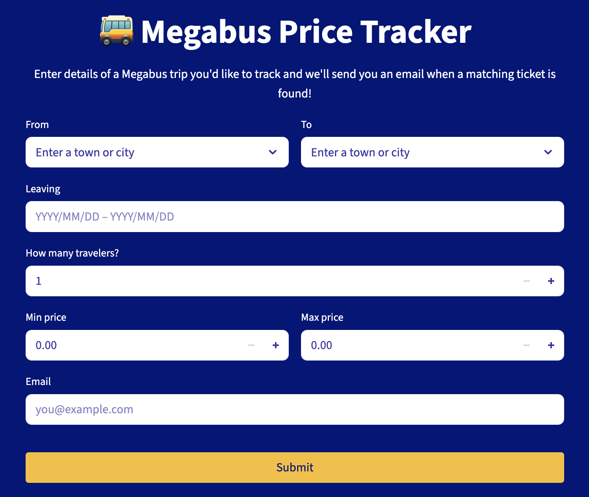

# Megabus Price Tracker

    
  

Megabus Price Tracker is a web app that monitors Megabus ticket prices and sends you an email alert when prices match your preferred criteria. 

Link: https://jane-megabus-scraper.streamlit.app/

⚠️ Disclaimer: Scraping the Megabus website goes against their terms and conditions :( so therefore this project is for educational purposes only and not available for public use.

---

## ✨ Features

- 🔍 Search for Megabus trips between North American cities  
- 🎯 Set custom filters: date range, price range, and number of passengers  
- 📬 Receive real-time email alerts when matching tickets are found  
- 🔐 Secure login system using Firebase Authentication  
- 🗃️ Criteria data stored in Firebase Firestore  
- 🚀 Automated price checks every 3 hours using GitHub Actions  
- 🧹 Auto-deletes trackers after a match is found or when past their end date

## 🛠 Tech Stack

- **Frontend**: Streamlit 
- **Database**: Firebase Firestore  
- **Authentication**: Firebase Auth  
- **Email Service**: AWS SES  
- **Automation**: GitHub Actions  
- **Backend Logic**: Python

